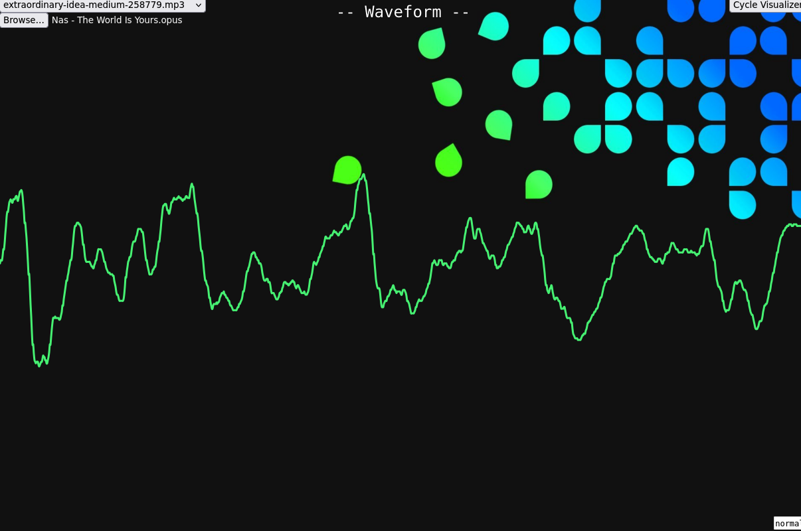

# visualize.me

My project for Multimedia Technology @ [AUEB](http://aueb.gr), Winter 2024-2025.

## Installation

> If you've worked with Node.js before, the following instructions should be
> self-explanatory.

To install the required npm packages, do:

    npm install

Confirm the packages installed correctly with:

    npm list

The output should look something like this:

    <project_dir>@ <path_to_project>
    ├── express@<version>
    ├── multer@<version>
    └── nodemon@<version>

The p5.js library is fetched from [cdnjs](http://cdnjs.com) inside
[index.html](./public/index.html).

## Getting Started

To start serving the application, just run:

    npm run start

## Credits

### Songs

1. *Level VII Short*, by [moodmode][moodmode] from Pixabay.
2. *Extraordinary Idea Medium*, by [moodmode][moodmode] from Pixabay.
3. *Music for Arcade Style Game*, by [lucadialessandro][luca] from Pixabay.
4. *Cool Driver*, by [Emmraan][Emmraan] from Pixabay.

### Images \& Icons

1. [Graph icons created by Retinaicons - Flaticon][graph icons]
2. [Background image by dr15](http://whvn.cc/g7ewjd)

[moodmode]: http://pixabay.com/users/moodmode-33139253/
[luca]: http://pixabay.com/users/lucadialessandro-25927643/
[Emmraan]: http://pixabay.com/users/emmraan-24732583/
[graph icons]: http://www.flaticon.com/free-icons/graph
